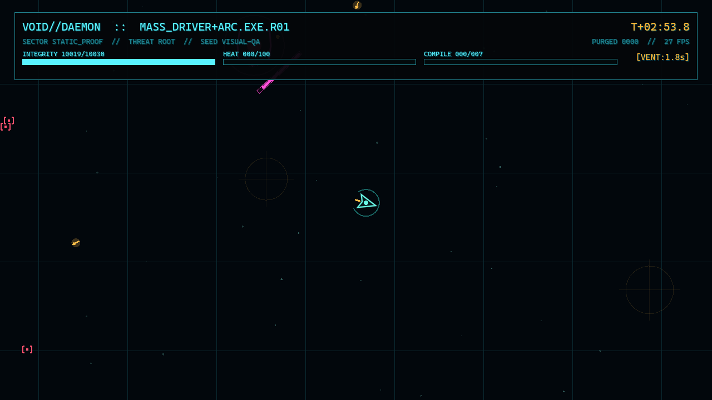
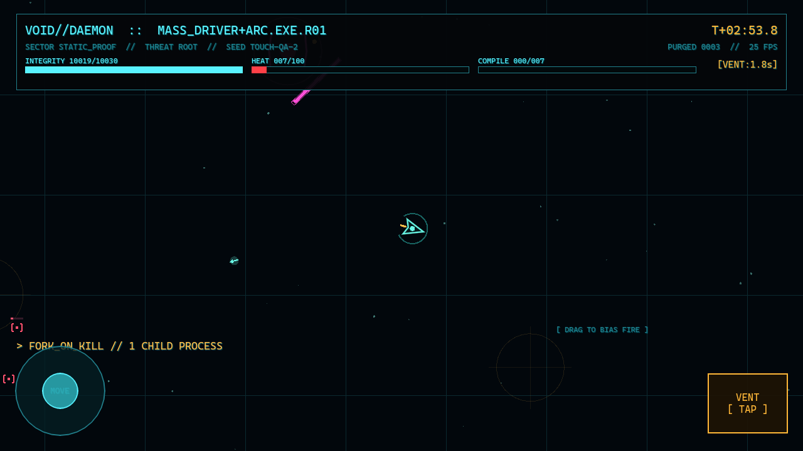
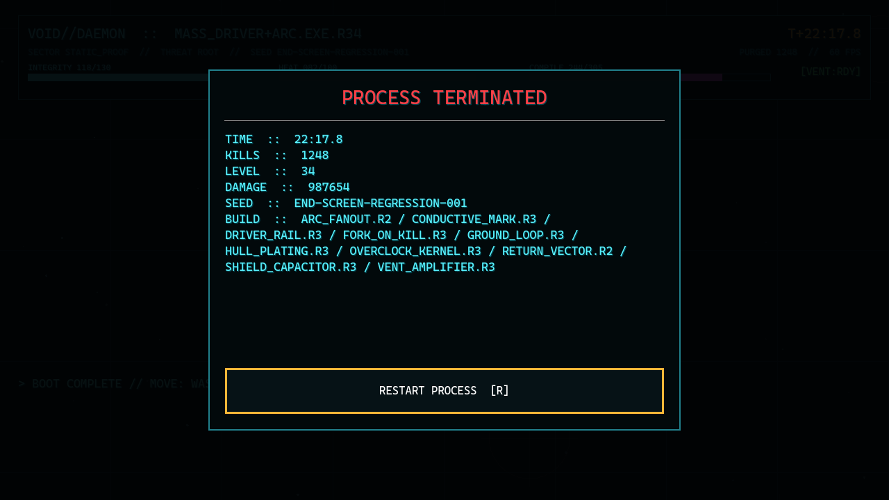

# VOID//DAEMON — playable Godot prototype



This repository contains an executable combat proof for the game plan. It deliberately tests the uncertain part first: whether two auto-running weapon processes become interesting when behavioral patches change their targeting and geometry.

The prototype uses Godot 4.7.1, GDScript, code-drawn visuals, and procedurally synthesized audio — **zero external asset dependencies**.

## Run it

On Windows, the execution-policy-free launcher is:

```text
run_game.cmd
```

The first argument is a seed; pass `touch` as the second argument to preview mobile controls:

```text
run_game.cmd SIGNAL-42 touch
```

From PowerShell, if local script execution is enabled:

```powershell
.\run_game.ps1
```

Run a repeatable seed:

```powershell
.\run_game.ps1 -Seed "SIGNAL-42"
```

Preview the mobile controls on desktop:

```powershell
.\run_game.ps1 -Seed "TOUCH-42" -Touch
```

You can also open `project.godot` in Godot and press **F6/F5**.

## Controls

### Mouse and keyboard

- `WASD` or arrow keys: move.
- Mouse position: bias both weapon processes toward that direction.
- `Space` or right mouse: `VENT` reactor heat for knockback, damage, and brief contact protection.
- `1`, `2`, `3` or mouse: choose an upgrade.
- `T`: show/hide the touch layer for desktop testing.
- `F10`: debug-skip to the boss.

### Controller

- Left stick: move.
- Right stick: bias fire.
- `A` or right shoulder: `VENT`.
- Upgrade cards use normal controller focus and accept input.

### Mobile touch

- Lower-left virtual stick: move.
- Drag on the right side: bias fire.
- Lower-right `VENT` button: vent the reactor.
- Tap upgrade cards directly.

The touch layout observes the platform safe area and the project is locked to landscape orientation.

## What is implemented

- A five-minute escalating survival phase followed by `WATCHDOG_01`, a multi-pattern boss.
- `MASS_DRIVER`: selects dense lines and fires piercing rounds.
- `ARC.EXE`: chains between nearby contacts.
- Thirteen ranked upgrade definitions, including:
  - `FORK_ON_KILL`;
  - `RETURN_VECTOR`;
  - `DRIVER_RAIL`;
  - `CONDUCTIVE_MARK`;
  - `ARC_FANOUT`;
  - `GROUND_LOOP`;
  - heat, shield, hull, and `VENT` patches.
- Deterministic upgrade offers and spawn/visual rolls derived from the displayed run seed.
- `BIT`, `VECTOR`, and `SENTRY` enemy roles with distinct glyphs, movement, and telegraphs.
- Shield, hull, reactor heat, throttling, cooling, `VENT`, XP collection, leveling, and end-of-run telemetry.
- Terminal HUD, responsive upgrade modal, restart flow, seed display, boss warning, and touch controls.
- Code-only vector/glyph presentation, arc effects, vent rings, stars, grid, and seeded anomaly marks.
- Procedurally generated synth cues for weapons, damage, `VENT`, upgrades, boss arrival, victory, and death.
- A runtime smoke mode that exercises all enemy roles, both weapons, several patches, the boss, friendly/hostile projectiles, pickups, and touch-safe UI construction.

## Validate it

```powershell
.\test_game.ps1
```

Or use the execution-policy-free wrapper:

```text
test_game.cmd
```

Expected runtime markers:

```text
SMOKE_CONTRACTS_OK deterministic_offer=[...]
SMOKE_START ... boss=true
SMOKE_OK ... hostile=... boss_health=...
```

The test first asserts that a seed and build state return three deterministic, unique upgrade cards. It then uses the portable Godot console build for a five-second integrated combat simulation.

## Screenshots

### Desktop gameplay


### Touch controls


### End-of-run telemetry


Regenerate the long-build end-screen regression capture with:

```text
.tools\godot\Godot_v4.7.1-stable_win64.exe --path . -- --capture-end-screen
```

## Project layout

```text
src/
├── main.gd                    Run orchestration, input, spawning, XP, boss, FX
├── actors/
│   ├── player_ship.gd         Device-agnostic ship movement, hull/shield/heat
│   ├── enemy.gd               BIT, VECTOR, and SENTRY behavior
│   ├── projectile.gd          Shared player/enemy projectile actor
│   ├── watchdog_boss.gd       Prototype boss
│   └── xp_orb.gd              Attraction and collection
├── systems/
│   ├── upgrade_catalog.gd     Seeded offer catalog
│   └── weapon_controller.gd   MASS_DRIVER/ARC.EXE behavior and patch logic
├── ui/terminal_hud.gd         HUD, upgrade/end modals, touch controls
├── audio/synth_audio.gd       Procedurally generated SFX cues
└── world/arena_backdrop.gd    Seeded code-drawn arena presentation
```

## Intentional prototype limits

- The arena is static; the seed currently controls its decoration, spawn sequence, and upgrade candidates, not procedural collision geometry.
- There is no meta progression, route system, save migration, online service, or commercial scaffolding.
- Enemy counts target readable combat rather than the old 1,000-enemy planning number.
- `COMPILE` evolutions remain out until the process/patch loop proves fun in play.
- Android/iOS export templates and signing toolchains are not installed, but the runtime input/UI path is touch-native rather than mouse emulation.

The right next step is playtesting, not adding breadth. Watch whether players reposition differently after `FORK_ON_KILL`, `RETURN_VECTOR`, and `ARC_FANOUT`, and whether they use `VENT` deliberately rather than on cooldown.
